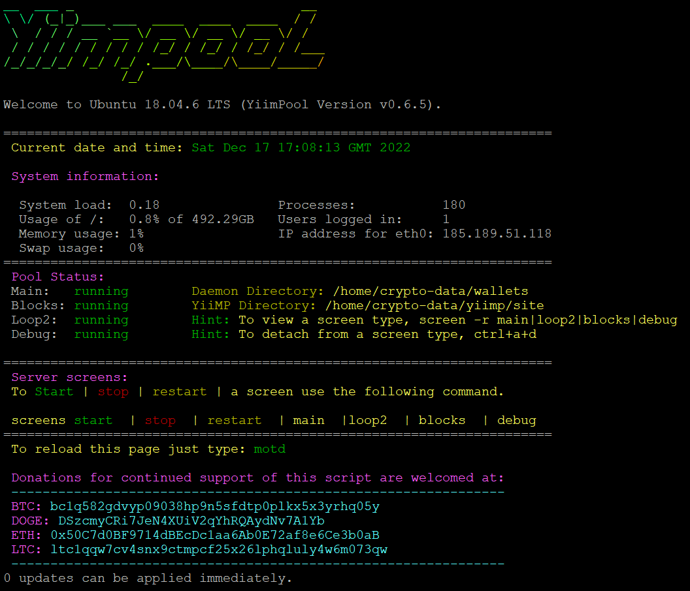

<h1 align="center">Yiimpool Yiimp Installer with DaemonBuilder and Addport Support</h1>
<p align="center">
  
  
  
</p>
<p align="center">
  
</p>
<h2 align="center">Description</h2>
<p>Yiimpool Yiimp Installer is an automated script that sets up a fully functional Yiimp mining pool on an Ubuntu 18.04 or 20.04 VPS. The script includes necessary dependencies, configurations, and security settings to get your pool up and running. Features include:</p>
<ul>
  <li>Automatic coin daemon compilation using DaemonBuilder</li>
  <li>Support for custom ports</li>
  <li>SSL certificate installation from Let's Encrypt</li>
  <li>Intuitive web interface for managing your pool</li>
</ul>
<p>Designed for both new and experienced users with clear installation instructions and comprehensive documentation.</p>
<h2 align="left">⚙️ Requirements</h2>
<ul>
  <li>Fresh Ubuntu 18.04 or 20.04 VPS</li>
  <li>Minimum 8GB RAM</li>
</ul>
<h2 align="left">ℹ️ DaemonBuilder</h2>
<p>A tool that downloads and compiles coins. To use, type "daemonbuilder" in terminal. Compile time depends on VPS CPU power.</p>
<h2 align="left">💾 Installation</h2>
<h3 align="left">Installer will ask:</h3>
<ul>
  <li>Using domain name</li>
  <li>Using sub-domain as main domain?</li>
  <li>Domain Name</li>
  <li>Stratum Domain</li>
  <li>Install SSL</li>
  <li>Support Email</li>
  <li>Public IP</li>
  <li>DB Root Password</li>
  <li>DB Panel User Password</li>
  <li>DB Stratum Password</li>
  <li>Admin Portal Access Location</li>
  <li>Stratum to be built with autoexchange enable</li>
</ul>
<h4 align="left">To install:</h4>

```
curl https://raw.githubusercontent.com/afiniel/yiimp_install_script/master/install.sh | bash

```
  Installation will take approximately 15 minutes. The installer will let you know when the installation is complete.
  If you have any issues with the installation, open an issue here on Github.


<h3>Finish! Remember to</h3>
<h4>A server reboot is REQUIRED after the installation is fully completed to finalize the installation process</h4>
<p>
  After rebooting the server, log back in to your user account you have created. When the rebooting process is complete, log in again with your user account and you have successfully installed YiiMP on your server.
</p>
<h4>On first reboot it may take up to 1-2 minutes before the cron screens auto-start. After waiting 1-2 minutes type:</h4>
<pre>
motd
</pre>
<p>
  To help make your server more secure, the install locations and directory structure of YiiMP have been changed as follows:
</p>
<table>
  <thead>
    <tr>
      <th>Directory</th>
      <th>Files</th>
    </tr>
  </thead>
  <tbody>
    <tr>
      <td><pre>/home/crypto-data/yiimp</pre></td>
      <td>General install location for YiiMP</td>
    </tr>
    <tr>
      <td><pre>/home/crypto-data/yiimp/starts</pre></td>
      <td>screens and stratum sh files - you do not need to run these</td>
    </tr>
    <tr>
      <td><pre>/home/crypto-data/yiimp/site</pre></td>
      <td>-</td>
    </tr>
    <tr>
      <td><pre>/home/crypto-data/yiimp/site/web</pre></td>
      <td>New location for YiiMP web files</td>
    </tr>
    <tr>
      <td><pre>/home/crypto-data/yiimp/site/backup</pre></td>
      <td>backup location for MySQL DB</td>
    </tr>
    <tr>
      <td><pre>/home/crypto-data/yiimp/site/configuration</pre></td>
      <td>New location of your serverconfig.php</td>
    </tr>
    <tr>
      <td><pre>/home/crypto-data/yiimp/site/crons</pre></td>
      <td>New location of the "main:blocks:loop2" sh files</td>
    </tr>
    <tr>
      <td><pre>/home/crypto-data/yiimp/site/log</pre></td>
      <td>New location for debug.log and your nginx server log</td>
    </tr>
    <tr>
      <td><pre>/home/crypto-data/yiimp/site/stratum</pre></td>
      <td>New location for your stratum files</td>
    </tr>

Permissions have been setup correctly allowing your main user write acess to the /home/crypto-data directories! Changing file or directory permissions after install will cause your YiiMP to not function correctly you have been warned!!

<!-- 🔗 Commands -->
<h3>Commands</h3>
<p>To view your running screens, run the following command:</p>
<pre>
screen -list
</pre>
<p>To view a specific screen, run the following command:</p>
<pre>
screen -r main|loop2|blocks|debug
</pre>
<p>To detach from a screen, type:</p>
<pre>
ctrl+a+d (DO NOT use ctrl+c, it will kill your screen)
</pre>
<p>To start, stop, or restart a specific screen (main, loop2, blocks, or debug), type:</p>
<pre>
screens start|stop|restart main|loop2|blocks|debug
</pre>
<p>We also suggest typing:</p>
<pre>
yiimp
</pre>

<!-- 🎁 Support -->
<h3>Support</h3>
<p>If you want to support our project, you can make a donation to any of the following addresses:</p>
<ul>
  <li>BTC: bc1q3k7ag4tf45x60swzuk3djvkelw3xdfkgpjxjm0</li>
  <li>ETH: 0x50C7d0BF9714dBEcDc1aa6Ab0E72af8e6Ce3b0aB</li>
  <li>DOGE: D7bjqNwyevTYK9JDZbJPQJXbd1b7PosPDT</li>
  <li>KASPA: kaspa:qqdwrqfn6n0hf0gsycrqqmv8z7x6s0wgh4x6kat6nzgyksf525w0ups70mrz0</li>
  <li>BEP-20: 0x50C7d0BF9714dBEcDc1aa6Ab0E72af8e6Ce3b0aB</li>
  <li>Polygon: 0x50C7d0BF9714dBEcDc1aa6Ab0E72af8e6Ce3b0aB</li>
</ul>
<p>We appreciate your generosity and support. Thank you!</p>

